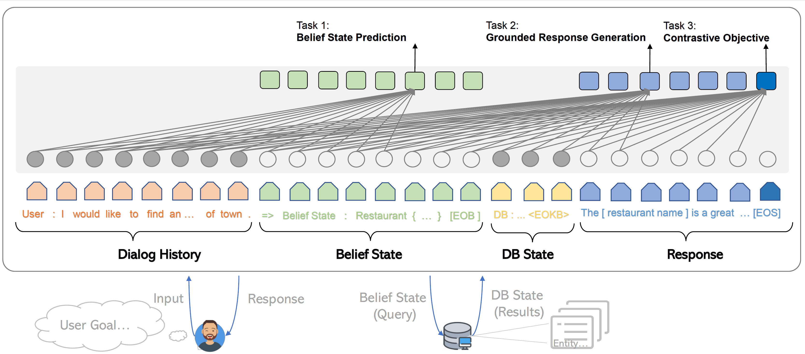

# SOLOIST - Building Task-oriented Bot at Scale  

## Introduction
This repository showcases **building task-oriented bot at scale with handful examples via fintuning a pretrained model** using SOLOIST framework, and contains the dataset, source code and pre-trained model for the following paper:

[SOLOIST: Building Task Bots at Scale with Transfer Learning and Machine Teaching
](https://arxiv.org/abs/2005.05298)  
Baolin Peng, Chunyuan Li, Jinchao Li, Shahin Shayandeh, Lars Liden, Jianfeng Gao  
*Transactions of the Association for Computational Linguistics 2021*




SOLOIST is a new pre-training-fine-tuning paradigm for building task-oritend dialog systems. We parameterize a dialog system using a Transformer-based auto-regressive language model, which subsumes different dialog modules (e.g. state tracker, dialog policy, response generator) into a single neural model. We pre-train, on large heterogeneous dialog corpora, a large-scale Transformer model which can generate dialog responses grounded in user goals and real-world knowledge for task completion. The pre-trained model can be efficiently fine-tuned and adapted to accomplish a new dialog task with a handful of task-specific dialogs via fine-tuning and machine teaching.

This repository is based on hugginface transformer and OpenAI GPT-2. Some evaluation scripts and dataset are adapted from [MultiWOZ]([https://github.com/budzianowski/multiwoz](https://github.com/budzianowski/multiwoz)), [Schema-guided Dataset](https://github.com/google-research-datasets/dstc8-schema-guided-dialogue), etc..

The included scripts can be used to reproduce the results reported in the paper. Project and demo webpage: [https://aka.ms/soloist](https://aka.ms/soloist)

## Installation
Require python 3.6.  
The interactive interface requries *vue* framework. Please refer to [here](https://cn.vuejs.org/index.html) for installation.

Please use the below commands to clone the repo and install required package.
```
git clone 
pip install -r requirements.txt
```
Fetch and unzip the pretrained model based on which to continue finetune your own data. (*will release more versions of pretrained models, stay tuned*) 

```zsh
wget https://bapengstorage.blob.core.windows.net/soloist/gtg_pretrained.tar.gz
cd soloist
tar -xvf gtg_pretrained_model.tar.gz
```
## Pipeline
**Data format**
```json
  {
    "history": [
      "user : later I have to call Jessie"
    ],
    "belief": "belief : name = Jessie",
    "kb": "",
    "reply": "system : Sure, added to your reminder list. FOLLOWUP action_set_reminder"
  },
```
We use json to represent a training example. As shown in the example, it contains the following fields:
* **history** - The context from session beginning to current turn
* **belief** - The belief state. 
* **kb** - Database query results, leave it as blank if db query is not requried.
* **reply** - The target system respose. It can be a template, an api call or natural language.

**Training**
```bash
python train.py --output_dir=MODEL_SAVE_PATH --model_type=gpt2 --model_name_or_path=PRE_TRAINED_MODEL_PATH --do_train --train_data_file=TRAIN_FILE  --per_gpu_train_batch_size 4 --num_train_epochs EPOCH --learning_rate 5e-5 --overwrite_cache --use_tokenize --save_steps 10000 --max_seq 500 --overwrite_output_dir --max_turn 15 --num_candidates 1 --mc_loss_efficient 0.2 --add_special_action_tokens --with_code_loss --add_belief_prediction --add_response_prediction --add_same_belief_response_prediction
```
<code>output_dir </code>: Path of the saving model.  
<code>model_name_or_path </code>: Initial checkpoint;  
<code>num_train_epochs </code>: Number of training epochs;  5, 10, 20 are enough for a reasonable performance.  
<code>learning_rate </code>: Learning rate; 5e-5, 1e-5, or 1e-4.  
<code>num_candidates </code>: number of candidate; recommend 1.  
<code>mc_loss_efficient </code>: contrastive loss coefficient; 0.1 to 1.  
<code>add_belief_prediction </code>: if add contrastive loss item for belief span.  
<code>add_response_prediction </code>: if add contrastive loss item for response prediction.  
<code>add_same_belief_response_prediction </code>: if add contrastive loss item for belief span and response.  

**Generation**
```python
python generate.py --model_type=gpt2 --model_name_or_path=SAVED_MODEL --num_samples NS --input_file=TEST_FILE --top_p TOP_P --temperature TEMP --output_file=OUTPUT_FILE --max_turn 15
```
<code>model_name_or_path </code>: Path of the saved model.  
<code>num_samples </code>: Number of samples; 1 or 5 for reranking.  
<code>top_p </code>: Nuclear sampling; 0.2 - 0.5  
<code>temperature </code>: Nuclear sampling; 0.7 - 1.5  
<code>input_file </code>: Path to input file.  
<code>output_file </code>: Path to save results.

**Interaction**  

We provide an demo interface to chat with finetuned models. The backend server is based on *flask* and the interface is based on *vue*, *bootstrap-vue*, and *BasicVueChat*.

Start the backend server:
```bash
python EXAMPLE_server.py # start the sever and expose 8081 port, users need to write own server code following examples/reminderbot/reminderbot_server.py
```
Start serving frontend page:
```bash
npm install
npm run serve 
```
Open localhost:8080, you will see the following page. Note that the backend port should be consistent with the port used in html/compoents/chat.vue.


## Pre-training with homogeneous dialog corpora
Theoretically, all dialog related corpora or domain-specific corpous, like insurrance, banking domian dialog log sesssions, can be used to pre-train soloist. For simplicity, in this repo we showcase pretraining with publicly available corpus. Incorporating other dataset is straightforward.

```bash
sh scripts/pretrain_preprocessing.sh
```
```bash
sh scripts/soloist_pretrain.sh
```
With 8 v100 GPUs, checkpoints at step 300k - 500k are able to demonstrate good transfer learning capability.

## Tutorial - Building a reminder bot based on Soloist framework with a handful of examples.

Using our framework, it is not necessary to explicitly define and annotate user intents and system policy. If log dialogue sessions are available, the only annotaiton required is dialogue state. Otherwise, the training examples can be obtained by following steps: 1) user drafts several rules/templates as seed. 2) tree traversal algorithm to generate seed dialogs. 3) use our previous work SC-GPT to augment the training corpus (*optional*, related papers can be found at [here](https://arxiv.org/abs/2002.12328) and [here](https://arxiv.org/abs/2004.13952]).

### Reminderbot
In this tutorial, you will build a simple assitant with which you can chat to add calling reminders or remove all reminders. The example is adapted from [RASA Reminderbot](https://github.com/RasaHQ/rasa/tree/3fca2f1ecdadc8c9f555a339eef2b11ce526e93b/examples/reminderbot).

We use rules and tree traversal to generate 34 examples as training set.
```bash
#under examples/reminderbot
python convert_rasa.py
```
*Finetune with pre-trained Soloist model*
```bash
#under soloist folder
sh script/train_reminderbot.sh
```
*Interact with above trained model*
```bash
#under examples/reminderbot
python reminderbot_server.py
#under soloist/html 
npm install
npm run serve
```
A demo vedio on chatting with reminder bot is at [here](https://bapengstorage.blob.core.windows.net/soloist/gtg_reminder_bot.mp4).


### Knowledgebasebot
In this tutorial, you will build a simple knowledge base query bot. The example is adapted from [RASA knowledgebasebot](https://github.com/RasaHQ/rasa/tree/master/examples/knowledgebasebot).

The procedure is similar to how you build reminderbot. 
```bash
python convert.py
```
*Finetune with pre-trained Soloist model*
```bash
sh train_kbbot.sh
```
*Interact with above trained model*
```bash
#under examples/reminderbot
python reminderbot_server.py
#under soloist/html
npm run serve
```

### Multiwoz experiments

Check [here](https://github.com/pengbaolin/soloist/tree/master/examples/multiwoz) for details.


## Disclaimer
This repository aims to facilitate research in a paradigm shift of building task bots at scale. This toolkit contains only part of the modeling machinery needed to actually produce a model weight file in a running dialog. On its own, this model provides only information about the weights of various text spans; in order for a researcher to actually use it, they will need to bring in-house conversational data of their own for furture pre-training and decode the response generation from the pretrained/finetuned system. Microsoft is not responsible for any generation from the 3rd party utilization of the pretrained system.

## Citation
if you use this code and data in your research, please cite our arxiv paper:
```
@article{peng2020soloist,
  title={SOLOIST: Building Task Bots at Scale with Transfer Learning and Machine Teaching},
  author={Peng, Baolin and Li, Chunyuan and Li, Jinchao and Shayandeh, Shahin and Liden, Lars and Gao, Jianfeng},
  journal={arXiv preprint arXiv:2005.05298},
  year={2020}
}
```

